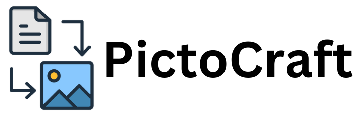

# PictoCraft



PictoCraft is a creative web application inspired by OpenAI's DALL·E, designed to generate imaginative images from text descriptions. This project leverages state-of-the-art AI technology to allow users to explore the world of AI-generated art and customize their image creations.

## Table of Contents

- [Features](#features)
- [Demo](#demo)
- [Getting Started](#getting-started)
- [Usage](#usage)
- [Frontend](#frontend)
- [Backend](#backend)
- [Hosted Application](#hosted-application)
- [Contributing](#contributing)
- [License](#license)

## Features

- **Text-to-Image Generation**: Provide a text description, and PictoCraft will generate a unique image based on your input.
- **Customization**: Fine-tune generated images by adjusting parameters like style, size, colors, and more.
- **User-Friendly Interface**: The intuitive design of PictoCraft makes it accessible to users of all levels of expertise.
- **AI-Powered**: Powered by GPT-3.5, PictoCraft employs cutting-edge AI technology for image creation.

## Demo

For a live demonstration of PictoCraft, please visit our [hosted application](https://pictocraft.netlify.app/).

## Getting Started

### Prerequisites

- Node.js and npm installed on your local machine.

### Installation

1. Clone the repository:

   ```sh
   git clone https://github.com/iamshivanshyadav/PictoCraft.git
   ```

2. Navigate to the project directory:

   ```sh
   cd PictoCraft
   ```

3. Install the project dependencies for both the frontend and backend:

   ```sh
   npm install
   ```

   ```sh
   cd server
   npm install
   ```

### Configuration

Before using PictoCraft, you'll need to set up your API keys for OpenAI. Rename the `.env.example` file to `.env` and add your OpenAI API key:

```shell
OPENAI_API_KEY=your_api_key_here
```

### Starting the Development Servers

- Frontend:

  To run the development server for the frontend, use the following command:

  ```sh
  npm start
  ```

- Backend:

  To start the backend server, run the following command within the `server` directory:

  ```sh
  npm start
  ```

PictoCraft will be available at [http://localhost:3000](http://localhost:3000).

## Usage

1. Visit the PictoCraft website.

2. Enter a text description in the input field.

3. Customize the image generation parameters if desired.

4. Click the "Generate Image" button.

5. Wait for the AI to create your image. You can download it once it's ready.

## Frontend

The frontend of PictoCraft is built using technologies like React and Vite. The main entry point is `App.js`, which handles the user interface and interaction.

### Sample Frontend Code:

```jsx
// App.js
import React from 'react';
// ... (other imports)

const App = () => (
  // ... (content)
);

export default App;
```

## Backend

The backend of PictoCraft is built with Node.js and Express. It communicates with the frontend, handles image generation requests, and connects to the MongoDB database.

### Sample Backend Code:

```javascript
// server.js
import express from 'express';
// ... (other imports)

// ... (app configuration)

const startServer = async () => {
  try {
    connectDB(process.env.MONGODB_URL);
    app.listen(8000, () => console.log('Server has started'));
  } catch (error) {
    console.log(error);
  }
}

startServer();
```

## Hosted Application

- [PictoCraft Hosted Application](https://pictocraft.netlify.app/)

## GitHub Repository

- [PictoCraft GitHub Repository](https://github.com/iamshivanshyadav/PictoCraft)

## Contributing

We welcome contributions from the community! If you'd like to contribute to PictoCraft, please follow these steps:

1. Fork the repository.

2. Create a new branch with a descriptive name for your feature or fix.

3. Make your changes and ensure the codebase is up to date with the latest changes from the main branch.

4. Test your changes thoroughly.

5. Create a pull request (PR) with a clear description of your changes.

6. We will review your PR, provide feedback, and merge it once it's ready.

## License

This project is licensed under the [MIT License](LICENSE). Feel free to use and modify the code as you see fit.

---

We hope you enjoy using PictoCraft! If you have any questions, encounter issues, or want to contribute, feel free to reach out to us.
